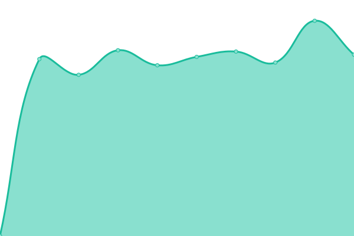
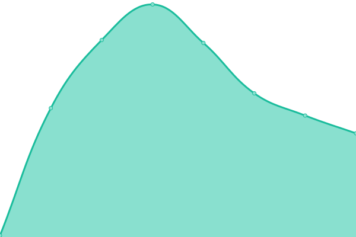
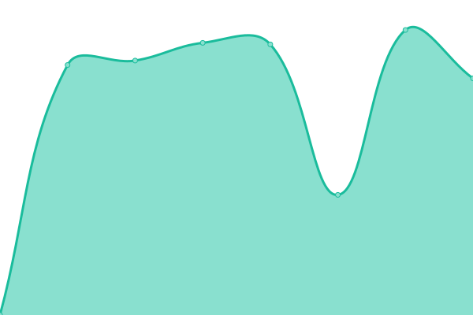

# [📈 Live Status](https://loftwah.github.io/loftwah-upptime): <!--live status--> **🟩 All systems operational**

This repository contains the open-source uptime monitor and status page for [Dean Lofts](https://lofts.sh), powered by [Upptime](https://github.com/upptime/upptime).

With [Upptime](https://upptime.js.org), you can get your own unlimited and free uptime monitor and status page, powered entirely by a GitHub repository. We use [Issues](https://github.com/loftwah/loftwah-upptime/issues) as incident reports, [Actions](https://github.com/loftwah/loftwah-upptime/actions) as uptime monitors, and [Pages](https://loftwah.github.io/loftwah-upptime) for the status page.

<!--start: status pages-->
<!-- This summary is generated by Upptime (https://github.com/upptime/upptime) -->
<!-- Do not edit this manually, your changes will be overwritten -->
<!-- prettier-ignore -->
| URL | Status | History | Response Time | Uptime |
| --- | ------ | ------- | ------------- | ------ |
|  [Loftwah The Beatsmiff](https://beatsmiff.com) | 🟩 Up | [loftwah-the-beatsmiff.yml](https://github.com/loftwah/loftwah-upptime/commits/HEAD/history/loftwah-the-beatsmiff.yml) | 

 1592ms
     
 | 

<a href="https://uptime.lofts.sh/history/loftwah-the-beatsmiff">100.00%</a>
    

|  [Grind Mode Cypher](https://grindmodecypher.com) | 🟩 Up | [grind-mode-cypher.yml](https://github.com/loftwah/loftwah-upptime/commits/HEAD/history/grind-mode-cypher.yml) | 

 854ms
     
 | 

<a href="https://uptime.lofts.sh/history/grind-mode-cypher">100.00%</a>
    

|  [Grind Mode Cypher Shop](https://shop.grindmodecypher.com) | 🟩 Up | [grind-mode-cypher-shop.yml](https://github.com/loftwah/loftwah-upptime/commits/HEAD/history/grind-mode-cypher-shop.yml) | 

 1465ms
     
 | 

<a href="https://uptime.lofts.sh/history/grind-mode-cypher-shop">100.00%</a>
    

|  [Lofts.sh](https://lofts.sh) | 🟩 Up | [lofts-sh.yml](https://github.com/loftwah/loftwah-upptime/commits/HEAD/history/lofts-sh.yml) | 

 120ms
     
 | 

<a href="https://uptime.lofts.sh/history/lofts-sh">100.00%</a>
    

|  [Mad Fap Entertainment](https://madfapentertainment.com) | 🟩 Up | [mad-fap-entertainment.yml](https://github.com/loftwah/loftwah-upptime/commits/HEAD/history/mad-fap-entertainment.yml) | 

 1488ms
     
 | 

<a href="https://uptime.lofts.sh/history/mad-fap-entertainment">100.00%</a>
    

|  [Perth Card Grading](https://perthcardgrading.com.au) | 🟩 Up | [perth-card-grading.yml](https://github.com/loftwah/loftwah-upptime/commits/HEAD/history/perth-card-grading.yml) | 

 128ms
     
 | 

<a href="https://uptime.lofts.sh/history/perth-card-grading">100.00%</a>
    

|  [Shake Down Records](https://shakedownrecords.com.au) | 🟩 Up | [shake-down-records.yml](https://github.com/loftwah/loftwah-upptime/commits/HEAD/history/shake-down-records.yml) | 

 2771ms
     
 | 

<a href="https://uptime.lofts.sh/history/shake-down-records">100.00%</a>
    

|  [Shake Down Studio](https://shakedownstudio.com.au) | 🟩 Up | [shake-down-studio.yml](https://github.com/loftwah/loftwah-upptime/commits/HEAD/history/shake-down-studio.yml) | 

 1637ms
     
 | 

<a href="https://uptime.lofts.sh/history/shake-down-studio">100.00%</a>
    

<!--end: status pages-->

[**Visit our status website →**](https://loftwah.github.io/loftwah-upptime)

## 📄 License

- Powered by: [Upptime](https://github.com/upptime/upptime)
- Code: [MIT](./LICENSE) © [Dean Lofts](https://lofts.sh)
- Data in the `./history` directory: [Open Database License](https://opendatacommons.org/licenses/odbl/1-0/)
